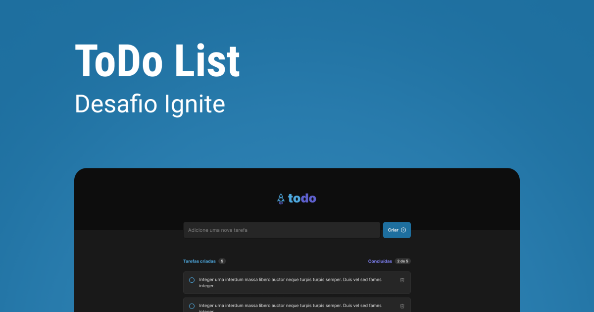

<p align="center">
  
  
  <p align="center">
  Made your tasks tracking simple!
  </p>

  
</p>

<p align="center">
  

  

  

  <br>

  

  <a href="https://www.linkedin.com/in/mathpsantos/">
    
  </a>
</p>

 
# Index

- :rocket: [Project Summary](#rocket-project-summary)
- 👨‍💻️ [Technologies Used](#%EF%B8%8F-technologies-used)
- 📦️ [How to install the project](#%EF%B8%8F-how-to-install-the-project)

---

## :rocket: Project Summary

This project was made in [Rocketseat's](https://rocketseat.com.br/) Ignite React Bootcamp, with the goal to practice ReactJS fundamentals concepts!

> Made only for learning purposes.

---

## 👨‍💻️ Technologies Used

This project was developed using the technologies bellow:

  - [ReactJS](https://reactjs.org/)
  
### Dependencies
  - [Vite](https://vitejs.dev/)
  - [Typescript](https://www.typescriptlang.org/)
  - [TailwindCSS](https://tailwindcss.com/)
  - [PostCSS](https://postcss.org/)
  - [Phosphor Icons](https://phosphoricons.com/)

### IDE

  - [Visual Studio Code](https://code.visualstudio.com/)

---
 
## 📦️ How to install the project

To clone the project, use the commands bellow:

```bash
  # Clone the repository
  ❯ git clone https://github.com/MathPSantos/ignite-todo

  # Enter directory
  ❯ cd ignite-todo
```


### Frontend

To install dependencies and initialize the project, you can use **Yarn** or **NPM**:

**Using yarn**

```bash
  # Install the dependencies
  ❯ yarn

  # Start the project
  ❯ yarn dev
```

**Using npm**

*If you use NPM, delte `yarn.lock` file to see all installed dependencies in the best way.*

```bash  
  # Install the dependencies
  ❯ npm install

  # Start the project
  ❯ npm run dev
```

---

# License
[MIT License](/LICENSE)

<h4 align="center">
  Made with ❤️ by Matheus Pires Santos! <a href="https://www.linkedin.com/in/mathpsantos/">Get in touch</a> or send a email to matheus.psantos2016@gmail.com!
</h4>